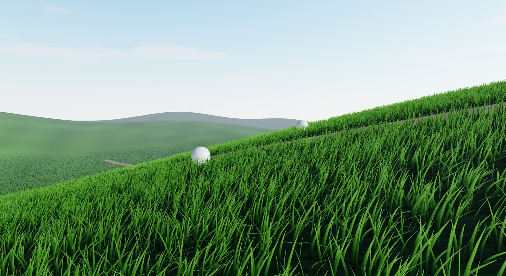

# threejs-worldgen

Procedural terrain and scenery for **three.js** and **react-three-fiber**. Each kind of thing you'd scatter or grow in
an outdoor scene is its own small package, and every package shares one idea of where the ground is.

**[Website](https://askalice.github.io/threejs-worldgen/)** · **[Live demo](https://askalice.github.io/threejs-worldgen/demo/)** · **[API docs](https://askalice.github.io/threejs-worldgen/docs/)**

[](https://askalice.github.io/threejs-worldgen/demo/)

## Packages

| Package | What it does |
|---|---|
| [`threejs-grass`](https://github.com/AskAlice/threejs-worldgen/tree/main/packages/grass) | Infinite, terrain-aware WebGPU grass: 12 presets, four LODs, wind, interaction, grass maps and a terrain painter. Includes a React component. |
| [`threejs-heightfield`](https://github.com/AskAlice/threejs-worldgen/tree/main/packages/heightfield) | Bakes meshes into fast `(x, z) => y` height lookups, with slope and ray-marching. The ground every other package stands on. |

Next up: 20 biomes, mountains, water, forests and savannas, and cities. [WORLDGEN.md](WORLDGEN.md) has the design
and the package plan. Every package takes a `Terrain` (a mesh or a height function) the same way `threejs-grass` does.

## Development

```bash
npm install          # links the workspaces
npm run dev          # demos at http://localhost:5173 and /r3f.html, running straight from packages/*/src
npm run typecheck
npm test             # node --test packages/*/test/*.test.ts
npm run build        # every package's dist/, in dependency order
npm run build:site   # landing page, demos and API docs into site/
```

New package: add `packages/<name>/` with its own `package.json` (`build` and `prepublishOnly` scripts), then list it in
`workspaces` (after its dependencies), in the `paths` in `tsconfig.json`, in the aliases in `example/vite.config.ts`
and in the `entryPoints` in `typedoc.json`.

## Releasing

Each package is versioned and released on its own. Tags are `<package>@<version>`:

```bash
npm version minor -w threejs-grass        # bumps packages/grass/package.json only
git commit -am "threejs-grass 0.3.0"
git tag threejs-grass@0.3.0 && git push origin main threejs-grass@0.3.0
```

The tag starts `.github/workflows/release.yml`, which checks the tag against the package version, runs typecheck
and the tests, publishes that one package to npm (using the `NPM_TOKEN` repo secret) and creates a GitHub release.
Release a package's dependencies first. For example, `threejs-grass` needs its `threejs-heightfield` range on npm.

## License

Apache-2.0
