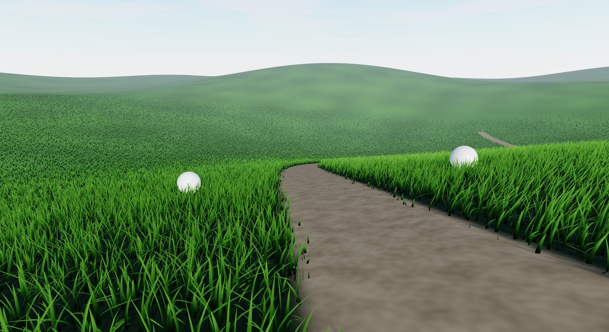
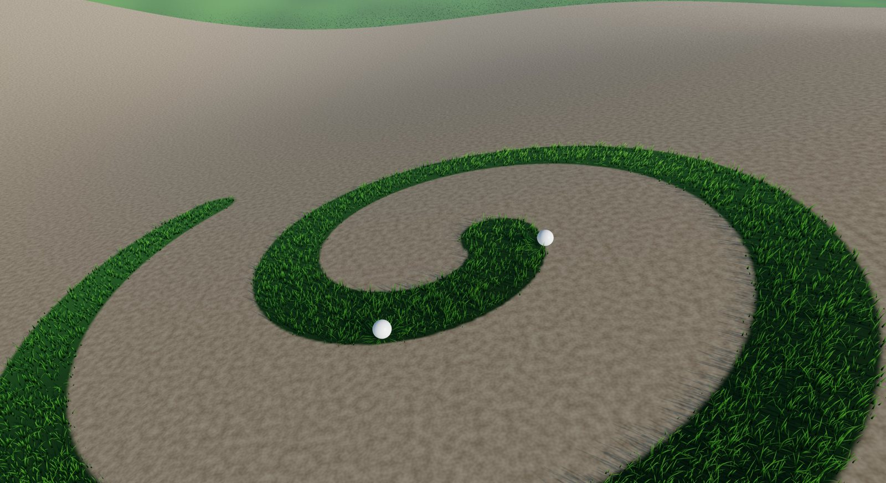
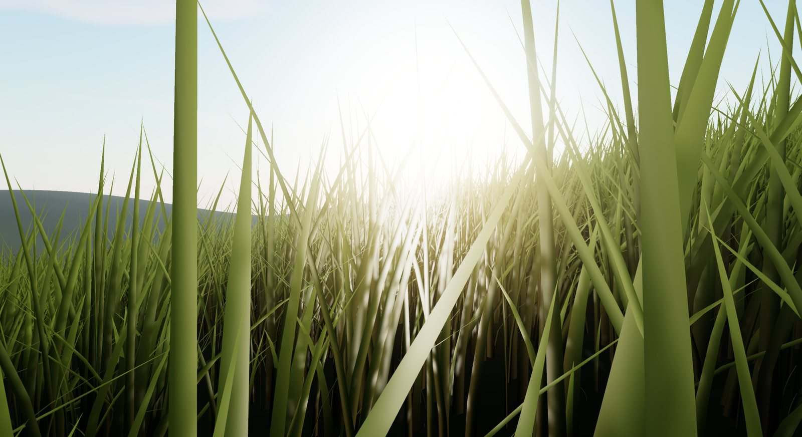
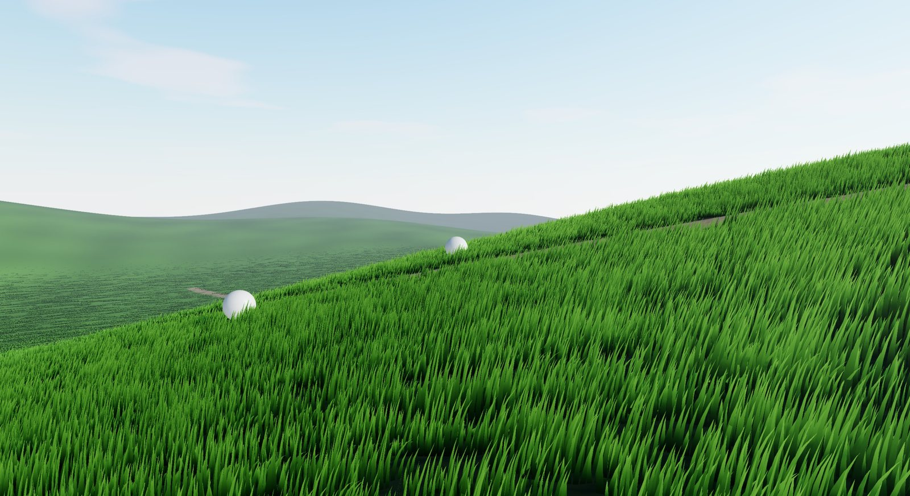
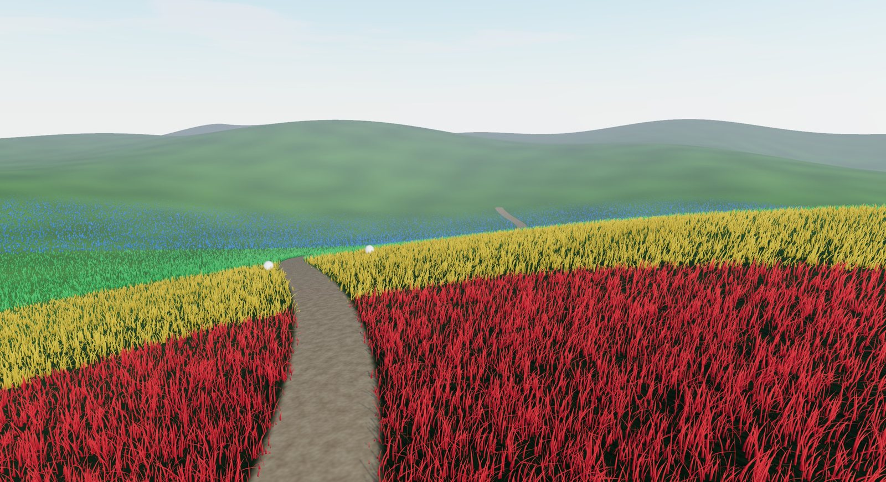
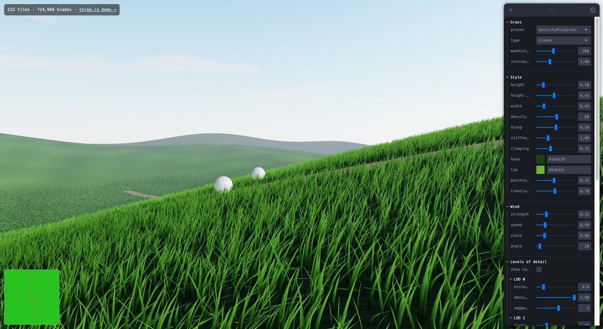
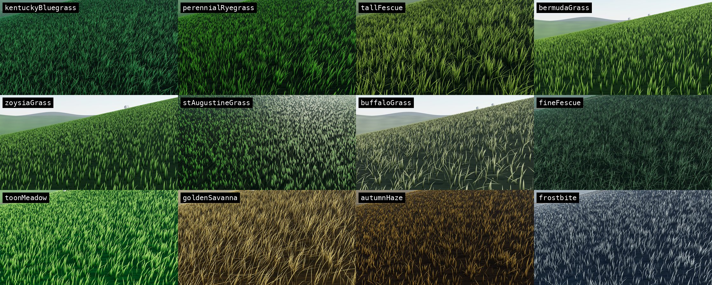

# threejs-grass

Infinite, terrain-aware grass for **three.js** and **react-three-fiber**, built on WebGPU (TSL).

**[Live demo (three.js)](https://askalice.github.io/threejs-grass/demo/)** · **[Live demo (React Three Fiber)](https://askalice.github.io/threejs-grass/demo/r3f.html)** · **[API docs](https://askalice.github.io/threejs-grass/)**


- **Infinite grass**: a tiled field that streams around the camera, so you never build one giant mesh.
- **Performance**: four configurable LODs, per-cell density allocation, smooth blade-by-blade thinning, frustum-culled tiles, and a time-budgeted tile builder.
- **12 presets**: eight inspired by real species (Kentucky Bluegrass, Perennial Ryegrass, Tall Fescue, …) and four stylized looks.
- **Two grass types**: detailed geometric blades, or lightweight billboard tufts.
- **Terrain aware**: pass a mesh (baked into a heightfield automatically) or a height function. Grass follows slopes and skips terrain that is too steep.
- **Natural wind**: direction, strength, noise scale and speed, with gusts that roll across the field.
- **Interaction**: up to 16 objects push grass aside.
- **Grass maps**: control where grass grows and how tall it is, for paths, clearings and fields.
- **Terrain painter**: paint coverage and height directly on the terrain.
- **Realistic shading**: clumping, field-scale colour patches, back-lit translucency, tinted sheen, root occlusion, shadows.

```ts
const grass = await Grass.create({ camera, scene, renderer, terrain, tileSize: 25, maxDistance: 200 })
```

That's it. The grass updates itself every time the scene renders.

> **WebGPU only.** Use `WebGPURenderer` from `three/webgpu`. It falls back to WebGL2 by itself when WebGPU is unavailable. Classic `WebGLRenderer` is not supported. Tested with three r186.

## Gallery

| | |
|---|---|
|  **Grass maps**: paths and clearings |  **Terrain painter**: paint grass in the scene |
|  **Tall grass, back-lit translucency** |  **Billboard grass**: the lightweight type |
|  **Four LODs** (`debugLods`) |  **React Three Fiber demo** with leva controls |


*The 12 presets. Top row: Kentucky Bluegrass, Perennial Ryegrass, Tall Fescue, Bermuda. Middle row: Zoysia, St. Augustine, Buffalo, Fine Fescue. Bottom row: Toon Meadow, Golden Savanna, Autumn Haze, Frostbite.*

---

## Contents

- [Install](#install)
- [Quick start: three.js](#quick-start-threejs)
- [Quick start: react-three-fiber](#quick-start-react-three-fiber)
- [Concepts](#concepts)
- [API](#api)
  - [`Grass`](#grass)
  - [Settings (`GrassOptions` / `GrassInput` / `GrassSettings`)](#settings)
  - [`GrassLOD`](#grasslod) · [`WindOptions`](#windoptions) · [`Interactor`](#interactor) · [`GrassRenderer`](#grassrenderer)
  - [`presets`, `PresetName`, `GrassStyle`](#presets)
  - [`GrassMap`](#grassmap) · [`GrassMapOptions`](#grassmapoptions)
  - [`TerrainPainter`](#terrainpainter) · [`Brush`, `BrushMode`](#brush)
  - [Terrain helpers: `createHeightSampler`, `bakeHeightfield`, `raycastHeight`, `slopeAt`, `HeightFn`, `Terrain`](#terrain-helpers)
  - [Geometry: `createBladeGeometry`, `createBillboardGeometry`](#geometry)
  - [Shader access: `GrassUniforms`, `GrassMapSample`, `MAX_INTERACTORS`](#shader-access)
  - [React: `<Grass>`, `GrassProps`, `GrassImpl`](#react)
- [Performance tips](#performance-tips)
- [Running the demos](#running-the-demos)

---

## Install

```bash
npm i threejs-grass three
# for React:
npm i @react-three/fiber react
```

Entry points:

| Import | Contents |
|---|---|
| `threejs-grass` | Everything framework-agnostic |
| `threejs-grass/react` | The `<Grass>` component, plus everything from `threejs-grass` (the class is exported as `GrassImpl`) |

## Quick start: three.js

```ts
import * as THREE from 'three/webgpu'
import { Grass } from 'threejs-grass'

const renderer = new THREE.WebGPURenderer({ antialias: true })
document.body.appendChild(renderer.domElement)

const scene = new THREE.Scene()
const camera = new THREE.PerspectiveCamera(50, innerWidth / innerHeight, 0.1, 2000)
scene.add(new THREE.HemisphereLight('#dff1ff', '#3b4a22', 1), new THREE.DirectionalLight('#fff', 3))

const terrain = new THREE.Mesh(myTerrainGeometry, new THREE.MeshStandardNodeMaterial({ color: '#2a3d16' }))
scene.add(terrain)

const grass = await Grass.create({ camera, scene, renderer, terrain, tileSize: 25, maxDistance: 200 })

renderer.setAnimationLoop(() => renderer.render(scene, camera)) // grass updates via scene.onBeforeRender
```

## Quick start: react-three-fiber

```tsx
import * as THREE from 'three/webgpu'
import { Canvas, extend, type ThreeToJSXElements } from '@react-three/fiber'
import { useRef } from 'react'
import { Grass } from 'threejs-grass/react'

declare module '@react-three/fiber' {
  interface ThreeElements extends ThreeToJSXElements<typeof THREE> {}
}
extend(THREE as any)

function Scene() {
  const terrain = useRef<THREE.Mesh>(null)
  return (
    <>
      <hemisphereLight args={['#dff1ff', '#3b4a22', 1]} />
      <directionalLight position={[30, 50, 20]} intensity={3} />
      <mesh ref={terrain} geometry={myTerrainGeometry}>
        <meshStandardNodeMaterial color="#2a3d16" />
      </mesh>
      <Grass terrain={terrain} preset="kentuckyBluegrass" tileSize={25} maxDistance={200} />
    </>
  )
}

export default () => (
  <Canvas gl={async (props) => { const r = new THREE.WebGPURenderer(props as any); await r.init(); return r }}>
    <Scene />
  </Canvas>
)
```

---

## Concepts

**Tiles.** The XZ plane is split into `tileSize` squares. Every frame, tiles within `maxDistance` of the camera are kept, and tiles outside are disposed. Each tile is one instanced draw call, frustum-culled as a whole.

**Cells and LODs.** Each tile is split into cells of about 5 m. A cell holds only as many blades as its distance needs, according to the four `lods`. In the shader, density is interpolated smoothly between LODs, and blades are removed one by one in a fixed random order. Thinning never pops and never reshuffles. Remaining blades get wider so coverage stays constant. Each LOD also sets the blades' vertical `segments`.

**Determinism.** Blade placement depends only on world position and settings, so a revisited area looks exactly the same.

**Terrain.** A mesh is baked once into a heightfield by CPU rasterisation, which works for any geometry including transformed groups. A height function `(x, z) => y` is called directly, which suits infinite procedural worlds. Grass is skipped where the height is `NaN` (off the mesh) or where the slope exceeds `maxSlope`.

**Grass map.** An optional world-space texture: R controls coverage (thinning), G controls height. Edits are live because the map is sampled on the GPU.

---

## API

Every entry below has a **three.js** (vanilla) example and a **React Three Fiber** example. R3F snippets
assume a `<Canvas>` with a `WebGPURenderer` as in [Quick start: react-three-fiber](#quick-start-react-three-fiber),
plus `const terrain = useRef<THREE.Mesh>(null)` on your ground mesh.

### `Grass`

An infinite, camera-centred grass field. In R3F, use the [`<Grass>`](#react) component, which creates
this class for you. The class itself is exported as `GrassImpl` from `threejs-grass/react`.

```ts
class Grass {
  static create(options: GrassOptions): Promise<Grass>
  constructor(options: GrassOptions)

  readonly object: THREE.Group          // root of all tiles; added to `scene` if you passed one
  readonly uniforms: GrassUniforms      // shader uniforms (advanced)
  readonly stats: { tiles: number; instances: number }
  camera: THREE.Camera                  // may be swapped at any time
  settings: GrassSettings               // resolved settings (read-only — use set())
  sampleHeight: HeightFn                // terrain height at (x, z); NaN off-terrain

  set(input: GrassInput): this
  reset(input?: GrassInput): this
  setTerrain(terrain?: Terrain): void
  update(budgetMs?: number): void
  dispose(): void
  densityAt(distance: number): number
  mapNode(worldXZ: Node<'vec2'>): GrassMapSample
}
```

#### `Grass.create(options)`

Validates the renderer, initialises it if needed, creates the field and builds every visible tile so the
first frame is complete. Throws if `renderer` is not a `WebGPURenderer`. See [Settings](#settings).

**three.js**
```ts
import { Grass } from 'threejs-grass'
const grass = await Grass.create({ camera, scene, renderer, terrain, preset: 'tallFescue', maxDistance: 150 })
```

**React Three Fiber**
```tsx
import { Grass } from 'threejs-grass/react'
<Grass terrain={terrain} preset="tallFescue" maxDistance={150} />
```

#### `new Grass(options)`

Takes the same options as `create`, but skips renderer validation and the initial full build, so tiles
stream in over the next frames. Prefer `Grass.create`.

**three.js**
```ts
const grass = new Grass({ camera, terrain })
scene.add(grass.object)
renderer.setAnimationLoop(() => { grass.update(); renderer.render(scene, camera) })
```

**React Three Fiber**
```tsx
// Only needed if you want to manage the instance yourself:
import { GrassImpl } from 'threejs-grass/react'
function ManualGrass() {
  const camera = useThree((s) => s.camera)
  const grass = useMemo(() => new GrassImpl({ camera, preset: 'bermudaGrass' }), [camera])
  useEffect(() => () => grass.dispose(), [grass])
  useFrame(() => grass.update())
  return <primitive object={grass.object} />
}
```

#### `grass.set(input)`

Changes any settings at runtime and returns `this`.
- **Visual settings** (colours, height, width, droop, wind, LOD distances, `debugLods`, interaction, translucency, …) apply instantly through uniforms.
- **Layout settings** (`type`, `density`, `heightVariation`, `widthVariation`, `clumping`, `clumpSize`, `maxSlope`, `lods`, `tileSize`) rebuild tiles in the background. Old blades stay visible until each tile is rebuilt.

Values merge into what was set before and persist across calls. `undefined` values are ignored, and
`wind` merges field by field. To drop earlier overrides, use [`reset`](#grassresetinput).

**three.js**
```ts
grass.set({ preset: 'goldenSavanna', bladeHeight: 1.6, wind: { strength: 0.8 } })
```

**React Three Fiber**
```tsx
// Just change props; the component applies them for you.
const [tall, setTall] = useState(false)
<Grass terrain={terrain} preset="goldenSavanna" bladeHeight={tall ? 1.6 : 0.8} wind={{ strength: 0.8 }} />
```

#### `grass.reset(input?)`

Replaces all settings with `input`. Anything not given falls back to the preset, then to the defaults. Use
it to switch presets cleanly after overriding style fields such as colours. `<Grass>` uses it internally,
so props are declarative: removing a prop reverts it.

**three.js**
```ts
grass.set({ preset: 'tallFescue', tipColor: '#ff0000' })
grass.set({ preset: 'frostbite' })    // still red tips: set() merges
grass.reset({ preset: 'frostbite' })  // frostbite exactly as designed
```

**React Three Fiber**
```tsx
// Props are reset() each render: when `highlight` turns off, tipColor returns to the preset's colour.
<Grass terrain={terrain} preset="frostbite" tipColor={highlight ? '#ff0000' : undefined} />
```

#### `grass.setTerrain(terrain?)`

Swaps the terrain (mesh, group or height function) and regenerates all tiles.

**three.js**
```ts
grass.setTerrain((x, z) => Math.sin(x * 0.05) * 3)
grass.setTerrain(otherTerrainMesh)
```

**React Three Fiber**
```tsx
// Swap the `terrain` prop to another object/ref, or call setTerrain through the ref:
const grass = useRef<GrassImpl>(null)
<Grass ref={grass} terrain={terrain} />
// later:
grass.current?.setTerrain((x, z) => Math.sin(x * 0.05) * 3)
```

#### `grass.update(budgetMs?)`

Re-centres tiles on the camera, streams tiles in and out, and refreshes interactors, the sun direction and
stats. `budgetMs` (default `settings.buildBudget`) caps time spent building tiles this frame.

**three.js**
```ts
// Automatic when `scene` was passed to create(). Otherwise, once per frame:
renderer.setAnimationLoop(() => { grass.update(); renderer.render(scene, camera) })
```

**React Three Fiber**
```tsx
// <Grass> already calls update() in useFrame. With GrassImpl directly:
useFrame(() => grass.update())
```

#### `grass.dispose()`

Removes the grass from its parent, unhooks the scene, and frees GPU resources.

**three.js**
```ts
grass.dispose()
```

**React Three Fiber**
```tsx
// <Grass> disposes on unmount — just stop rendering it:
{showGrass && <Grass terrain={terrain} />}
```

#### `grass.densityAt(distance)`

Returns the fraction (0..1) of full density at a distance from the camera. This is the CPU mirror of the
shader's LOD curve.

**three.js**
```ts
console.log(grass.densityAt(10), grass.densityAt(100)) // e.g. 0.88, 0.04
```

**React Three Fiber**
```tsx
const grass = useRef<GrassImpl>(null)
useEffect(() => console.log(grass.current?.densityAt(50)), [])
<Grass ref={grass} terrain={terrain} />
```

#### `grass.mapNode(worldXZ)`

Returns TSL nodes `{ coverage, height }` that read the grass map at a world position. Use them in your
terrain material to show dirt where grass was erased. They track painting and `grassMap` swaps live.

**three.js**
```ts
import { mix, positionWorld, vec3 } from 'three/tsl'
const { coverage } = grass.mapNode(positionWorld.xz)
terrain.material.colorNode = mix(vec3(0.45, 0.35, 0.22), vec3(0.1, 0.16, 0.05), coverage)
terrain.material.needsUpdate = true
```

**React Three Fiber**
```tsx
import { mix, positionWorld, vec3 } from 'three/tsl'
const [grass, setGrass] = useState<GrassImpl | null>(null)
useEffect(() => {
  if (!grass || !terrain.current) return
  const material = terrain.current.material as THREE.MeshStandardNodeMaterial
  material.colorNode = mix(vec3(0.45, 0.35, 0.22), vec3(0.1, 0.16, 0.05), grass.mapNode(positionWorld.xz).coverage)
  material.needsUpdate = true
}, [grass])
<Grass ref={setGrass} terrain={terrain} grassMap={map} />
```

#### `grass.sampleHeight(x, z)`

Returns the terrain height the grass uses, which is handy for placing objects on the ground. Returns NaN
off-terrain.

**three.js**
```ts
ball.position.y = grass.sampleHeight(ball.position.x, ball.position.z) + 0.5
```

**React Three Fiber**
```tsx
const grass = useRef<GrassImpl>(null)
const ball = useRef<THREE.Mesh>(null)
useFrame(() => {
  const g = grass.current, b = ball.current
  if (g && b) b.position.y = g.sampleHeight(b.position.x, b.position.z) + 0.5
})
<Grass ref={grass} terrain={terrain} />
```

#### `grass.stats`

`{ tiles, instances }`, refreshed on every update.

**three.js**
```ts
hud.textContent = `${grass.stats.tiles} tiles · ${grass.stats.instances} blades`
```

**React Three Fiber**
```tsx
const grass = useRef<GrassImpl>(null)
useFrame(() => grass.current && (hud.current!.textContent = `${grass.current.stats.instances} blades`))
```

#### `grass.object`, `grass.camera`, `grass.settings`, `grass.uniforms`

- `object` is the `Group` containing all tiles.
- `camera` can be reassigned.
- `settings` is the resolved configuration. Read it, and change it with `set()`.
- `uniforms` is covered under [Shader access](#shader-access).

**three.js**
```ts
grass.camera = carCamera            // follow another camera
grass.object.visible = false        // hide all grass
console.log(grass.settings.bladeHeight)
```

**React Three Fiber**
```tsx
const grass = useRef<GrassImpl>(null)
useEffect(() => { if (grass.current) grass.current.object.visible = false }, [])  // hide all grass
<Grass ref={grass} camera={carCamera} terrain={terrain} />                         // follow another camera
```

---

### Settings

- `GrassOptions` is passed to `Grass.create`: `GrassInput` plus `camera`, `scene`, `renderer` and `terrain`.
- `GrassInput` is a partial `GrassSettings`, with `wind` also partial.
- In React, every field is a prop of `<Grass>`.

| Option | Type | Default | |
|---|---|---|---|
| `camera` | `Camera` | (required; R3F: default camera) | Camera the field follows |
| `scene` | `Object3D` | | Grass is added to it and auto-updates |
| `renderer` | `GrassRenderer` | | `WebGPURenderer`; initialised if needed |
| `terrain` | `Terrain` | flat at y = 0 | Mesh/group or `(x, z) => y` |
| `preset` | `PresetName` | `'kentuckyBluegrass'` | Starting look |
| `type` | `'blades' \| 'billboards'` | `'blades'` | Geometric blades or billboard tufts |
| `tileSize` | `number` | `25` | Tile edge (m) |
| `maxDistance` | `number` | `200` | Grass radius (m); fades over the last 15% |
| `lods` | `GrassLOD[4]` | see below | Exactly four levels, near → far |
| `wind` | `Partial<WindOptions>` | `{ direction: [1, 0.35], strength: 0.35, scale: 0.06, speed: 0.6 }` | |
| `maxSlope` | `number` | `1.2` | Max gradient (rise/run) that grows grass; `Infinity` = no limit |
| `grassMap` | `GrassMap \| null` | `null` | Coverage/height control |
| `interactors` | `Interactor[]` | `[]` | Up to 16 objects that push grass |
| `interactionStrength` | `number` | `1` | Push multiplier |
| `castShadow` | `boolean` | `true` | Near grass casts shadows |
| `shadowDistance` | `number` | `20` | Shadow-casting radius (m) |
| `receiveShadow` | `boolean` | `true` | |
| `sun` | `DirectionalLight \| null` | first DirectionalLight in the scene | Drives back-lit translucency |
| `debugLods` | `boolean` | `false` | Tints LODs red / yellow / green / blue |
| `buildBudget` | `number` | `3` | ms per frame spent building tiles |
| …every [`GrassStyle`](#presets) field | | from the preset | Overrides the preset |

**three.js**
```ts
const grass = await Grass.create({
  camera, scene, renderer, terrain,
  preset: 'perennialRyegrass',
  type: 'blades',
  tileSize: 25,
  maxDistance: 200,
  maxSlope: 0.9,
  castShadow: true,
  shadowDistance: 25,
  sun: sunLight,
  bladeHeight: 0.7,
})
```

**React Three Fiber**
```tsx
<Grass
  terrain={terrain}
  preset="perennialRyegrass"
  type="blades"
  tileSize={25}
  maxDistance={200}
  maxSlope={0.9}
  castShadow
  shadowDistance={25}
  sun={sunLight}
  bladeHeight={0.7}
/>
```

### `GrassLOD`

```ts
interface GrassLOD {
  distance: number  // where this LOD is fully reached (m)
  density: number   // fraction of full density kept (0..1)
  segments: number  // vertical segments per blade at this distance
}
```

Default `lods`:

```ts
[
  { distance: 8,   density: 1,    segments: 5 },
  { distance: 25,  density: 0.25, segments: 3 },
  { distance: 60,  density: 0.06, segments: 2 },
  { distance: 120, density: 0.03, segments: 1 },
]
```

**three.js**
```ts
// Denser near field, cheaper far field; tint LODs while tuning.
grass.set({
  debugLods: true,
  lods: [
    { distance: 12, density: 1, segments: 6 },
    { distance: 35, density: 0.3, segments: 3 },
    { distance: 80, density: 0.05, segments: 2 },
    { distance: 160, density: 0.02, segments: 1 },
  ],
})
```

**React Three Fiber**
```tsx
const lods: GrassLOD[] = [
  { distance: 12, density: 1, segments: 6 },
  { distance: 35, density: 0.3, segments: 3 },
  { distance: 80, density: 0.05, segments: 2 },
  { distance: 160, density: 0.02, segments: 1 },
]
<Grass terrain={terrain} lods={lods} debugLods />
```

### `WindOptions`

```ts
interface WindOptions {
  direction: [x: number, z: number]  // normalised internally
  strength: number                   // 0 still · 0.35 breeze · 1+ storm
  scale: number                      // noise frequency; smaller = broader gusts
  speed: number                      // how fast gusts travel
}
```

**three.js**
```ts
grass.set({ wind: { direction: [0, 1], strength: 0.9, scale: 0.04, speed: 1.5 } })
```

**React Three Fiber**
```tsx
<Grass terrain={terrain} wind={{ direction: [0, 1], strength: 0.9, scale: 0.04, speed: 1.5 }} />
```

### `Interactor`

```ts
interface Interactor {
  object: Object3D | { current: Object3D | null }  // object or React ref; world position read every frame
  radius: number                                    // influence radius (m)
}
```

**three.js**
```ts
grass.set({
  interactors: [{ object: player, radius: 1.2 }, { object: car, radius: 2.5 }],
  interactionStrength: 1.5,
})
```

**React Three Fiber**
```tsx
const player = useRef<THREE.Mesh>(null)   // refs work directly
<Grass terrain={terrain} interactors={[{ object: player, radius: 1.2 }]} interactionStrength={1.5} />
```

### `GrassRenderer`

The minimal renderer shape `Grass.create` checks: `{ isWebGPURenderer?, hasInitialized?(), init?() }`.
Pass a `WebGPURenderer` from `three/webgpu`. It uses WebGPU when available and WebGL2 otherwise.

**three.js**
```ts
import * as THREE from 'three/webgpu'
const renderer = new THREE.WebGPURenderer({ antialias: true })
await renderer.init()            // optional: Grass.create() does it if needed
const grass = await Grass.create({ camera, scene, renderer, terrain })
```

**React Three Fiber**
```tsx
// <Grass> reads the renderer from the Canvas; give the Canvas a WebGPURenderer:
<Canvas gl={async (props) => { const r = new THREE.WebGPURenderer(props as any); await r.init(); return r }}>
  <Grass terrain={terrain} />
</Canvas>
```

---

### Presets

`presets` is a record of 12 complete `GrassStyle`s. `PresetName` is its key type.

| Real species | Stylized |
|---|---|
| `kentuckyBluegrass`, `perennialRyegrass`, `tallFescue`, `bermudaGrass`, `zoysiaGrass`, `stAugustineGrass`, `buffaloGrass`, `fineFescue` | `toonMeadow`, `goldenSavanna`, `autumnHaze`, `frostbite` |

You can override any `GrassStyle` field individually. All of them apply live except the ones marked *layout*, which rebuild tiles:

| Field | Meaning |
|---|---|
| `density` | Blades per m² at LOD 0 (layout) |
| `bladeHeight` | Height in metres. Any value works (lawn ≈ 0.1, meadow ≈ 0.5, tall grass 1–3) |
| `heightVariation` | 0..1 random height spread (layout) |
| `bladeWidth` | Base width in metres |
| `widthVariation` | 0..1 random width spread (layout) |
| `curvature` | 0..1 natural droop |
| `stiffness` | Resistance to wind and interaction |
| `clumping` | 0..1 how much blades gather into outward-splaying tufts (layout) |
| `clumpSize` | Tuft diameter in metres (layout) |
| `baseColor`, `tipColor` | CSS colours; gradient root → tip |
| `colorVariation` | 0..1 per-blade brightness variation |
| `patchiness` | 0..1 field-scale light/dark and dry patches |
| `translucency` | 0..1.5 back-lit glow when looking towards the sun |

**three.js**
```ts
import { Grass, presets, type PresetName } from 'threejs-grass'
const grass = await Grass.create({ camera, scene, renderer, terrain, preset: 'goldenSavanna', bladeHeight: 1.4 })
console.log(presets.tallFescue.bladeHeight)            // 0.85
const names = Object.keys(presets) as PresetName[]     // for a dropdown
grass.set({ preset: 'frostbite', tipColor: '#ffffff' })
```

**React Three Fiber**
```tsx
import { Grass, presets, type PresetName } from 'threejs-grass/react'
const [preset, setPreset] = useState<PresetName>('frostbite')
<Grass terrain={terrain} preset={preset} tipColor="#ffffff" patchiness={0.6} />
```

---

### `GrassMap`

A world-space control texture covering a square of terrain. **R** is coverage (0 none … 1 full) and **G** is
height (0.5 = 1x … 1 = 2x). Outside the square, grass grows normally.

```ts
class GrassMap {
  constructor(options?: GrassMapOptions)
  static fromImage(image, options?): GrassMap
  readonly texture: DataTexture
  readonly data: Uint8Array        // RGBA, row 0 = minZ; set texture.needsUpdate after editing
  readonly resolution: number
  readonly size: number
  readonly minX: number
  readonly minZ: number
  load(image): this
  fill(coverage?: number, height?: number): void
  paint(x: number, z: number, brush: Brush): boolean
  toCanvas(): HTMLCanvasElement
  toDataURL(): string
  dispose(): void
}
```

| Method | |
|---|---|
| `fromImage(image, options)` | Creates a map from an image: red = coverage, green = height, top edge = −Z |
| `load(image)` | Replaces the contents with an image (scaled to `resolution`) |
| `fill(coverage = 1, height = 1)` | Fills everything; `fill(0)` clears all grass |
| `paint(x, z, brush)` | Soft round brush at world (x, z); returns `false` if the brush is outside the map |
| `toCanvas()` / `toDataURL()` | Exports the raw map (round-trips with `fromImage` / `load`) |
| `dispose()` | Frees the texture |

**three.js**
```ts
import { GrassMap } from 'threejs-grass'

// A dirt path and a clearing
const map = new GrassMap({ center: [0, 0], size: 300, resolution: 1024 })
for (let z = -150; z < 150; z += 0.5) map.paint(Math.sin(z * 0.05) * 20, z, { mode: 'erase', radius: 1.8, strength: 1 })
map.paint(30, 30, { mode: 'erase', radius: 8, strength: 1 })
grass.set({ grassMap: map })

// Save / load
localStorage.setItem('grass-map', map.toDataURL())
const img = new Image()
img.src = localStorage.getItem('grass-map')!
await img.decode()
map.load(img)
```

**React Three Fiber**
```tsx
import { Grass, GrassMap } from 'threejs-grass/react'

function Field({ pathImage }: { pathImage: HTMLImageElement }) {
  const map = useMemo(() => GrassMap.fromImage(pathImage, { size: 300 }), [pathImage])
  useEffect(() => () => map.dispose(), [map])
  return <Grass terrain={terrain} grassMap={map} />
}
```

### `GrassMapOptions`

```ts
interface GrassMapOptions {
  center?: [x: number, z: number]  // default [0, 0]
  size?: number                    // metres, default 256
  resolution?: number              // texels per side, default 512
  coverage?: number                // initial 0..1, default 1
  height?: number                  // initial multiplier 0..2, default 1
}
```

**three.js**
```ts
// Start empty and paint grass in (like a level editor)
const map = new GrassMap({ center: [100, -50], size: 200, resolution: 512, coverage: 0 })
```

**React Three Fiber**
```tsx
const map = useMemo(() => new GrassMap({ center: [100, -50], size: 200, coverage: 0 }), [])
<Grass terrain={terrain} grassMap={map} />
```

---

### `TerrainPainter`

Paints a grass's `grassMap` directly on the terrain. Left-drag applies the brush, and a ring follows the
pointer. Works with mesh and function terrain. Disable camera controls while painting, because they use
the same pointer events.

```ts
class TerrainPainter {
  constructor(grass: Grass, domElement: HTMLElement, brush?: Partial<Brush>)  // throws without grassMap
  enabled: boolean
  brush: Brush
  readonly cursor: Mesh
  dispose(): void
}
```

**three.js**
```ts
import { TerrainPainter } from 'threejs-grass'
const painter = new TerrainPainter(grass, renderer.domElement, { mode: 'add', radius: 3, strength: 0.3 })
controls.enabled = false          // OrbitControls off while painting
painter.brush.mode = 'erase'      // change the brush at any time
painter.enabled = false           // pause
painter.dispose()                 // remove listeners + cursor
```

**React Three Fiber**
```tsx
// The `paint` prop creates/disposes the painter; brush changes apply live.
const [painting, setPainting] = useState(false)
<Grass terrain={terrain} grassMap={map} paint={painting && { mode: 'add', radius: 3, strength: 0.3 }} />
<OrbitControls makeDefault enabled={!painting} />
```

### `Brush`

```ts
type BrushMode = 'add' | 'erase' | 'raise' | 'lower'   // coverage up/down, height up/down
interface Brush {
  mode: BrushMode
  radius: number     // metres
  strength: number   // 0..1 applied per stroke event at the centre
}
```

**three.js**
```ts
const brush: Brush = { mode: 'raise', radius: 6, strength: 0.2 }
map.paint(x, z, brush)                 // programmatic stroke
Object.assign(painter.brush, brush)    // or set the interactive painter's brush
```

**React Three Fiber**
```tsx
const [mode, setMode] = useState<BrushMode>('raise')
<Grass terrain={terrain} grassMap={map} paint={{ mode, radius: 6, strength: 0.2 }} />
```

---

### Terrain helpers

```ts
type HeightFn = (x: number, z: number) => number   // NaN = no terrain
type Terrain = Object3D | HeightFn

function createHeightSampler(terrain?: Terrain, maxResolution = 1024): HeightFn
function bakeHeightfield(root: Object3D, maxResolution = 1024): HeightFn
function raycastHeight(sample: HeightFn, origin: Vector3, dir: Vector3, maxDistance = 2000, step = 0.5): Vector3 | null
function slopeAt(sample: HeightFn, x: number, z: number, e = 0.25): number
```

| Function | |
|---|---|
| `createHeightSampler` | Turns a `Terrain` into a height lookup: functions as-is, meshes baked, nothing = flat |
| `bakeHeightfield` | Rasterises every mesh under `root` (with world transforms) into a bilinear heightfield. The highest surface wins |
| `raycastHeight` | Ray-marches and bisects against a height function; returns the hit or `null` |
| `slopeAt` | Gradient magnitude (rise/run) by central differences |

**three.js**
```ts
import { Grass, bakeHeightfield, raycastHeight, slopeAt, type HeightFn } from 'threejs-grass'

// Infinite procedural terrain
const height: HeightFn = (x, z) => Math.sin(x * 0.03) * 4 + Math.cos(z * 0.025) * 5
const grass = await Grass.create({ camera, scene, renderer, terrain: height })

// Click on the terrain
const ray = new THREE.Raycaster()
ray.setFromCamera(pointer, camera)
const hit = raycastHeight(grass.sampleHeight, ray.ray.origin, ray.ray.direction)

// Reuse a baked mesh heightfield for gameplay
const ground = bakeHeightfield(terrainMesh)
const steep = slopeAt(ground, 10, 20) > 1
```

**React Three Fiber**
```tsx
import { raycastHeight } from 'threejs-grass/react'

// Inline height functions are fine
<Grass terrain={(x, z) => Math.sin(x * 0.03) * 4 + Math.cos(z * 0.025) * 5} />

// Ray-march on pointer events
const grass = useRef<GrassImpl>(null)
<mesh onPointerDown={(e) => {
  const hit = grass.current && raycastHeight(grass.current.sampleHeight, e.ray.origin, e.ray.direction)
  if (hit) spawnFlower(hit)
}} />
```

---

### Geometry

```ts
function createBladeGeometry(segments: number): BufferGeometry      // tapered strip, x ∈ [-0.5, 0.5], y ∈ [0, 1]
function createBillboardGeometry(segments: number): BufferGeometry  // unit quad strip
```

These are the base shapes Grass instances. They are exposed for custom instancing setups (e.g. a few
hero blades), and you don't need them for normal use.

**three.js**
```ts
import { createBladeGeometry } from 'threejs-grass'
const blades = new THREE.InstancedMesh(createBladeGeometry(6), new THREE.MeshStandardNodeMaterial({ side: THREE.DoubleSide }), 100)
```

**React Three Fiber**
```tsx
import { createBladeGeometry } from 'threejs-grass/react'
const geometry = useMemo(() => createBladeGeometry(6), [])
<instancedMesh args={[geometry, undefined, 100]}><meshStandardNodeMaterial side={THREE.DoubleSide} /></instancedMesh>
```

---

### Shader access

```ts
const MAX_INTERACTORS = 16
type GrassUniforms = { baseColor, tipColor, bladeHeight, windStrength, windDirection, windScale, windSpeed,
                       viewPosition, sunDirection, sunColor, map, mapBounds, interactors, … }  // TSL nodes
interface GrassMapSample { coverage: Node<'float'>; height: Node<'float'> }
```

`grass.uniforms` exposes the live TSL uniforms, which are useful for syncing other effects with the grass (for
example, wind on trees). Change values with `grass.set()`, because uniforms are overwritten on every `set()`
call.

**three.js**
```ts
import { positionLocal, sin, time, vec3 } from 'three/tsl'
const u = grass.uniforms
treeMaterial.positionNode = positionLocal.add(
  vec3(u.windDirection.x, 0, u.windDirection.y).mul(sin(time.mul(u.windSpeed)).mul(u.windStrength).mul(positionLocal.y.mul(0.05))),
)
```

**React Three Fiber**
```tsx
const [grass, setGrass] = useState<GrassImpl | null>(null)
const treeMaterial = useMemo(() => {
  if (!grass) return null
  const u = grass.uniforms
  const m = new THREE.MeshStandardNodeMaterial()
  m.positionNode = positionLocal.add(vec3(u.windDirection.x, 0, u.windDirection.y).mul(sin(time).mul(u.windStrength).mul(0.1)))
  return m
}, [grass])
<Grass ref={setGrass} terrain={terrain} />
{treeMaterial && <mesh geometry={treeGeometry} material={treeMaterial} />}
```

---

### React

```ts
function Grass(props: GrassProps): JSX.Element | null
interface GrassProps extends GrassInput {
  ref?: Ref<GrassImpl | null>
  terrain?: Terrain | RefObject<Object3D | null>
  camera?: Camera
  paint?: Partial<Brush> | false
}
export { Grass as GrassImpl }  // the imperative class
```

- Creates the field on mount (and when `camera`, the renderer or the terrain object changes) and disposes it on unmount.
- Every other prop is applied with `grass.reset()` on render, so props are declarative (a removed prop reverts to the preset). This is cheap for visual props, and tiles rebuild only when layout props actually change.
- Updates every frame through `useFrame`.
- `ref` receives the `GrassImpl` instance.
- `paint` toggles a `TerrainPainter`; brush changes apply without recreating it.
- `threejs-grass/react` also re-exports everything from `threejs-grass`.

**React Three Fiber**
```tsx
import { Grass, GrassMap, type GrassImpl } from 'threejs-grass/react'

function Field() {
  const terrain = useRef<THREE.Mesh>(null)
  const ball = useRef<THREE.Mesh>(null)
  const grass = useRef<GrassImpl>(null)
  const map = useMemo(() => new GrassMap({ size: 300 }), [])
  useFrame(() => {
    const g = grass.current, b = ball.current
    if (g && b) b.position.y = g.sampleHeight(b.position.x, b.position.z) + 0.5
  })
  return (
    <>
      <mesh ref={terrain} geometry={hills} receiveShadow />
      <mesh ref={ball}><sphereGeometry args={[0.5]} /></mesh>
      <Grass
        ref={grass}
        terrain={terrain}
        preset="perennialRyegrass"
        type="blades"
        bladeHeight={0.8}
        grassMap={map}
        wind={{ strength: 0.5 }}
        interactors={[{ object: ball, radius: 1.2 }]}
      />
    </>
  )
}
```

**three.js** equivalent
```ts
const map = new GrassMap({ size: 300 })
const grass = await Grass.create({
  camera, scene, renderer, terrain,
  preset: 'perennialRyegrass', type: 'blades', bladeHeight: 0.8, grassMap: map,
  wind: { strength: 0.5 }, interactors: [{ object: ball, radius: 1.2 }],
})
renderer.setAnimationLoop(() => {
  ball.position.y = grass.sampleHeight(ball.position.x, ball.position.z) + 0.5
  renderer.render(scene, camera)
})
```

---

## Performance tips

- `density` and the first two `lods` dominate cost. Check the result with `grass.stats.instances` and tune with `debugLods`.
- Shadows are the next biggest cost. Keep `shadowDistance` small (default 20 m) or set `castShadow: false`.
- Billboards (`type: 'billboards'`) are several times cheaper than blades for large areas.
- Cap the device pixel ratio (e.g. `renderer.setPixelRatio(Math.min(devicePixelRatio, 1.5))`), because grass is fill-rate heavy.
- `buildBudget` trades tile pop-in for frame-time stability when the camera moves fast.

## Running the demos

```bash
npm install
npm run dev     # http://localhost:5173 (three.js + lil-gui) and /r3f.html (React + leva)
npm test        # terrain baking / ray-march checks
npm run build   # ESM + .d.ts into dist/
```

Both demos include a physical sky, sky-based ambient lighting, a sun with shadows that follows the camera, haze, ACES tone mapping, subtle bloom, a dirt path painted into a grass map, rolling balls that push the grass, a minimap, and controls for every feature.
